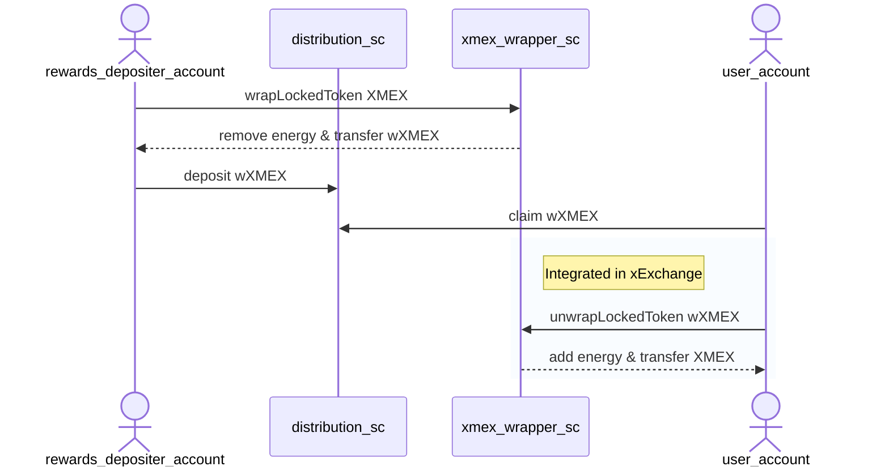

# Template to request LKMEX `transferRole`

## Transferability

To conserve its energy and protect its benefits, old and new LKMEX will no longer be transferable, subsequently bound to
the account where it is currently held. Some limited transfers for LKMEX will continue to be allowed - check the 
economics paper for more details.

Other services and products beyond xExchange can request transfer roles which will have to be authorized by governance 
votes. Before the xExchange launch, projects can submit a request to be whitelisted via Github.

We will consider eligible for transferRole only projects and smart contracts serving as catalysts for user adoption and 
those who bring valuable use cases (for example, use cases that go against the principles outlined above, where LKMEX 
rules are overridden, re-enabling selling or buying will not be eligible). After the xExchange launch, 
pre-whitelisted projects and SCs will potentially be revisited through a governance call.

The project has to make a pull request in the current repository, where it adds a new file in the LKMEX-whitelist 
folder by filling in the existing template document. The name of the document should be the name of the project.

Note: Projects will lose the transfer role after upgrading the contract. You need to make a new pull request, where 
new code updates brought to the smart contract must be explained and motivated.

Projects can also lose their `transferRole` status if the Smart Contract is being used in ways that go against LKMEX 
principles. Questionable activities will be reviewed by the MultiversX team and any Project or Smart Contract found in 
breach of the rules will automatically lose their transferRole status.

Whitelisted projects will be given a transferRole to the WXMEX tokenID, which is a token that does not 
have energy and is used only by whitelisted projects. 

The whitelisted projects will need to wrap the XMEX they want to deposit or use. By wrapping it, the XMEX will 
temporarily “lose” its energy but the energy can be recovered and regained by unWrap it back.

Projects will be able to use the wrappedXMEX to deposit and use in the whitelisted distribution Smart Contracts. Users who will
get/claim wrappedXMEX will need to unWrap it in order to gain its original energy and convert it back to XMEX 
in order to enter liquidity or farms.

wrappedXMEX does not have the benefits of the XMEX. Only after unwrapping you gain all the benefits.

### Usage specs

- rewards_depositer_account - user account from project side that should deposit rewards in the project's distribution smart contract; this should NOT be a smart contract
- distribution_sc - project's distribution smart contract that will receive transfer role for wrappedXMEX
- xmex_wrapper_sc - xmex wrapper smart contract owned by xExchange owner entity
- user_account - end user account that claims and uses the distributed rewards

## Name of the project
Hodl Token Club

## Description of the project
HodlTokenClub is an web3 organisation focused on capturing yield on xExchange and share it with its investors. We leverage MultiversX NFT's to distribute $HODL token (share of our net worth) and rewards generated on xExchange. 

## Purpose
We have build economic model enabling Comunity Farm growth on xExchange and generating incentive for new users to join, mint our NFT's and contributing to our ecosytem to grow as well as LKMEX rewards to grow in value as more capital is captured from minting process. Community farm is 100% own by $HODL token owners. Rewards are distributed everyday via #GiveawayEveryday scheme on Twitter. Over 4mths we distributed over 90 Million LKMEX to our Community members, eductaed them and helpped with farming on DEX. We belive we add value to entire MultiversX ecosystem as our project is solely based on capturing Yield on xExchange, growing our position and sharing part of it as rewards with community members and helping them with finding optimal strategy for their own farm. Our Yield generated in LKMEX never was sold and never will. All LKMEX rewards coming from Founder personal farm, to enable Community fam growth while capturing capital from our NFT minting process. [Why does the project need a transfer role for XMEX?]

## Address of Smart Contract
https://explorer.multiversx.com/accounts/erd1qqqqqqqqqqqqqpgqpvlxt3n9ks66kuq4j8cvcv25k8a5rsx99g6suw5r66

## Smart Contract Code
https://github.com/Shamsham01/hodl-token-club-staking-sc-mx

## Description for every Smart Contract functionality
The user will stake HODL Founder NFT (FHODL-a9ad67) to get access to 50% of the revenue generated by MultiversX xExchange LP Farms. XMEX rewards will be equally distributed among all staked NFTs, user will claim on their end on daily basis. 

## Number of users
219 Hodlers

## Average LKMEX/XMEX used during the previous month
July 2022 - 14,304,295.45 LKMEX
August 2022 - 21,589,709.65 LKMEX
September 2022 - 20,226,932.35 LKMEX
October 2022 - 20,217,769.61 LKMEX
November 2022 - 14,229,330.04 LKMEX
