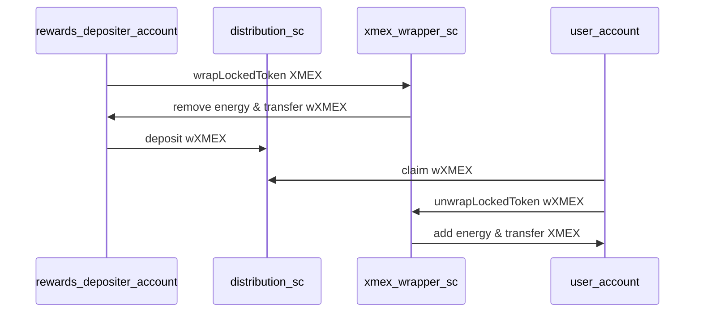

# Template to request LKMEX `transferRole`

## Transferability

To conserve its energy and protect its benefits, old and new LKMEX will no longer be transferable, subsequently bound to
the account where it is currently held. Some limited transfers for LKMEX will continue to be allowed - check the 
economics paper for more details.

Other services and products beyond xExchange can request transfer roles which will have to be authorized by governance 
votes. Before the xExchange (Maiar DEX 2.0) launch, projects can submit a request to be whitelisted via Github.

We will consider eligible for transferRole only projects and smart contracts serving as catalysts for user adoption and 
those who bring valuable use cases (for example, use cases that go against the principles outlined above, where LKMEX 
rules are overridden, re-enabling selling or buying will not be eligible). After the xExchange (Maiar DEX 2.0) launch, 
pre-whitelisted projects and SCs will potentially be revisited through a governance call.

The project has to make a pull request in the current repository, where it adds a new file in the LKMEX-whitelist 
folder by filling in the existing template document. The name of the document should be the name of the project.

Note: Projects will lose the transfer role after upgrading the contract. You need to make a new pull request, where 
new code updates brought to the smart contract must be explained and motivated.

Projects can also lose their `transferRole` status if the Smart Contract is being used in ways that go against LKMEX 
principles. Questionable activities will be reviewed by the MultiversX team and any Project or Smart Contract found in 
breach of the rules will automatically lose their transferRole status.

Whitelisted projects will be given a transferRole to the WXMEX tokenID, which is a token that does not 
have energy and is used only by whitelisted projects. 

The whitelisted projects will need to wrap the XMEX they want to deposit or use. By wrapping it, the XMEX will 
temporarily “lose” its energy but the energy can be recovered and regained by unWrap it back.

Projects will be able to use the wrappedXMEX to deposit and use in the whitelisted distribution Smart Contracts. Users who will
get/claim wrappedXMEX will need to unWrap it in order to gain its original energy and convert it back to XMEX 
in order to enter liquidity or farms.

wrappedXMEX does not have the benefits of the XMEX. Only after unwrapping you gain all the benefits.

### Contract usage specs

rewards_depositer_account - user account from project side that should deposit rewards in the project's distribution smart contract; this should NOT be a smart contract
distribution_sc - project's distribution smart contract that will receive transfer role for wrappedXMEX
xmex_wrapper_sc - xmex wrapper smart contract owned by xExchange owner entity
user_account - end user account that claims and uses the distributed rewards

## Name of the project
[Fill in]

## Description of the project
[What does the project do?]

## Purpose
[Why does the project need a transfer role for XMEX?]

## Address of Smart Contract
[address][link on explorer]

## Smart Contract Code
[Post link to github]

## Description for every Smart Contract functionality
[Post link to github]

## Number of users
## Average LKMEX/XMEX used during the previous month
